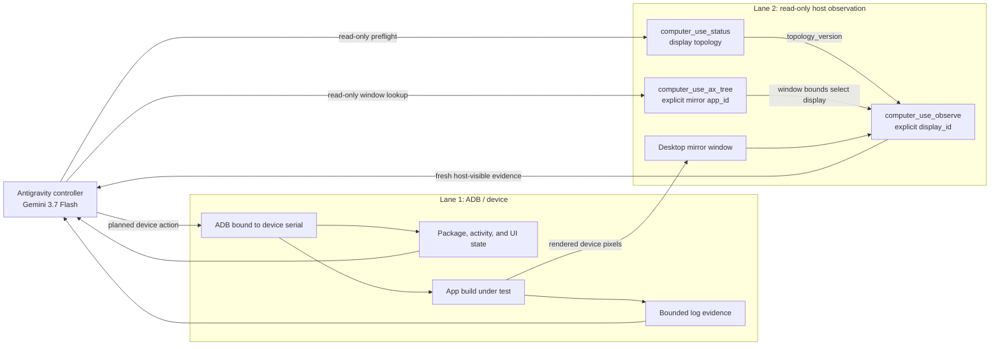

# Dual-Lane Mobile Verification

## Correlating ADB device truth with Antigravity Computer Use host-visible proof

Dual-lane verification combines a device-side protocol path with a separate
host-visible observation path. The two lanes provide complementary evidence;
they do not make a result infallible, establish root cause, or become
independent merely because one agent reads both.

Use this method to answer a bounded question such as:

> Did this exact app build, on this exact Android target, reach the expected
> device state and render the expected result in the selected mirror window?

## Lane Responsibilities

### Lane 1: ADB device authority and mutation

ADB owns the measured device action and device-side evidence:

- bind every command to an explicit device serial;
- bind the run to the APK or build digest under test;
- install, launch, and dispatch the planned device action;
- collect bounded package, activity, UIAutomator, and log evidence;
- record command status without treating a zero exit code as visual proof.

During the measured step, ADB is the only mutation lane. Do not also click or
type through the desktop mirror and then claim independent observation.

### Lane 2: read-only host observation

Antigravity Computer Use owns host-visible evidence:

- call `computer_use_status` and record the current display topology;
- call `computer_use_ax_tree` with the mirror application's explicit
  `app_id` to identify its window and bounds;
- select the display containing that window;
- call `computer_use_observe` with that explicit `display_id`;
- preserve the fresh `capture_id`, `topology_version`, observation time,
  and sanitized artifact identity.

The observation lane is read-only. Do not use `computer_use_click`,
`computer_use_type`, shortcuts, scrolling, or dragging as a fallback inside
the measured proof step.

## Architecture



## Required Evidence Identity

A proof packet must bind at least:

| Surface | Required identity |
|---|---|
| Source/build | source commit and APK/build SHA-256 |
| Device | explicit ADB serial plus observed model/API level |
| Action | exact bounded action and its terminal status |
| App state | package/activity or semantic assertion used by the acceptance criteria |
| Mirror target | explicit host `app_id` and observed window bounds |
| Display | `display_id` and `topology_version` |
| Observation | fresh `capture_id`, timestamp, artifact SHA-256, and redaction status |
| Decision | explicit expected outcome and the comparison actually performed |

Multiple devices require separate identity records and fresh observations. One
desktop frame does not prove the state of every attached or virtual device.

## Bounded Verification Sequence

1. Freeze the source, build, device, action, and expected outcome.
2. Confirm the target device is present under the explicit ADB serial.
3. Call `computer_use_status`, then use explicit-app AX inspection to locate
   the mirror window and choose its display.
4. Perform the single planned device mutation through ADB.
5. Collect the bounded device-side state and logs needed by the acceptance
   criteria.
6. Capture a fresh host observation on the selected display.
7. Compare both lanes with the predeclared expected outcome.
8. Report pass, fail, or unknown without expanding the claim.

Any topology change, mirror movement, host input, device reconnect, app
restart, or operator intervention invalidates the affected evidence. Re-run
the relevant preflight and capture fresh proof.

Host setup or recovery is a separate step. Global-HID Computer Use actions
require an explicitly exclusive GUI session, and macOS System Settings or TCC
changes remain human-gated. Evidence captured before those mutations is not
reusable as post-mutation proof.

## Result Interpretation

| Device lane | Host-visible lane | Result |
|---|---|---|
| Matches | Matches | Supports only the bounded acceptance criteria |
| Matches | Mismatches | Fail: semantic state did not produce the expected visible result |
| Mismatches | Matches | Fail or investigate: visible output lacks the required device-state support |
| Missing/ambiguous | Any | Unknown; gather fresh evidence |
| Any | Missing/ambiguous | Unknown; gather fresh evidence |

ADB can also capture device pixels, and host screenshots can expose useful
symptoms. Prefer the separate host path when the claim specifically concerns
what the operator-visible mirror rendered. Logs plus a crash frame support
correlation; they do not, by themselves, prove root cause.

## Example Command Shape

```sh
adb -s "$DEVICE_SERIAL" install -r app-under-test.apk
adb -s "$DEVICE_SERIAL" shell am start -n package.name/.MainActivity
adb -s "$DEVICE_SERIAL" logcat -d '*:E'
```

After the ADB step, use read-only `computer_use_ax_tree` and
`computer_use_observe` calls for the mirror application. Preserve only
sanitized receipts and selected proof artifacts; never publish credentials,
raw agent transcripts, unrelated desktop content, or notification data.

## Summary

> ADB establishes device-side state; Computer Use records what the selected
> host display rendered.

The useful claim is the intersection of those observations, bound to exact run
identity and explicit acceptance criteria.
