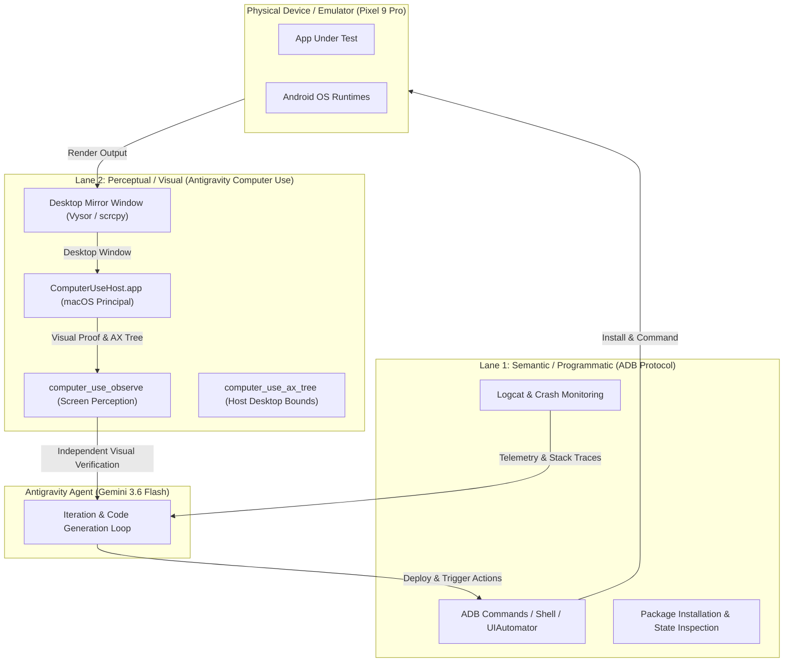

# Dual-Lane Autonomous Verification Architecture
## Combining Direct ADB Protocol & Antigravity Computer Use

You have hit on a fundamental paradigm shift in autonomous software engineering: **Dual-Lane Out-of-Band Verification**.

By pairing direct programmatic device control (**ADB Protocol Lane**) with independent visual & desktop perception (**Antigravity Computer Use Lane**), an AI agent achieves **uncheatable, closed-loop visual proof** while building and testing mobile applications.

---

### Architecture Overview

---

### Core Principles & Value Drivers

#### 1. Uncheatable Dual-Key Proof Invariant
- **The Problem**: Semantic assertions (e.g. "element exists in DOM/UIAutomator") frequently pass even when rendering is blank, clipped, z-indexed behind an overlay, or visually broken.
- **The Dual-Lane Solution**: 
  - **Lane 1 (ADB)** executes the action and inspects backend/app logs.
  - **Lane 2 (`computer-use`)** independently observes the rendered pixel output on the host display.
  - *Result*: The agent cannot declare a test passed unless both programmatic and visual channels confirm exact alignment.

#### 2. Self-Correction & Rapid Iteration Flywheel
- **Code Change** $\rightarrow$ **ADB Hot Reload / Install** $\rightarrow$ **`computer_use_observe` Visual Audit** $\rightarrow$ **Auto-Fix**
- When a UI glitch occurs (e.g. button overlapping text, keyboard obscuring input, wrong contrast mode), `computer-use` detects the exact visual regression immediately without needing human intervention to check the screen.

#### 3. Cross-Boundary Exception Handling
- **ADB Limitations**: ADB struggles with host-level popups, system permission dialogs, external app switches, camera preview overlays, and desktop mirror window management.
- **`computer-use` Superpower**: Handles the entire host environment — focusing Vysor, dismissing desktop notifications, toggling system settings, managing multiple device windows — keeping the device test harness active and unblocked.

#### 4. Parallel Physical & Virtual Test Execution
- Drivers can run on physical devices (e.g., Pixel 9 Pro over USB) and virtual emulators simultaneously, using `computer_use_observe` to capture side-by-side visual comparison proofs across hardware form factors.

---

### Practical Implementation Matrix

| Capability | Lane 1: ADB / Semantic | Lane 2: `computer-use` / Perceptual | Combined Synergy |
|---|---|---|---|
| **Build & Deploy** | `adb install -r app.apk` | Observes install notification & launcher icon | Guaranteed deployment & launch verification |
| **Input Dispatch** | `adb shell input tap x y` | `computer_use_click` at normalized grid coordinates | Dual-path interaction fallback & gesture validation |
| **Error Diagnosis** | `adb logcat *:E` stack trace | Captures screenshot of crash dialog / blank screen | Root-cause correlation (Logs + Visual Evidence) |
| **Visual QA** | N/A (No visual reasoning) | Multimodal visual layout reasoning | Zero-shot visual bug detection & layout alignment |

---

### Summary Invariant
> **"ADB moves the gears; `computer-use` watches the wheel."**  
> Combining programmatic control with independent desktop visual perception turns AI agents from blind script executers into fully autonomous, self-verifying product engineers.
