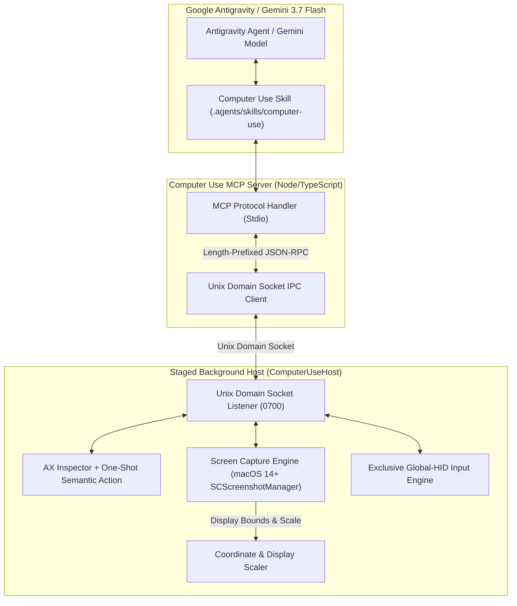

# Antigravity Computer Use (`agy-computer-use`)

[](https://apple.com)
[](https://deepmind.google/technologies/gemini/)
[](https://antigravity.google)
[](#)

> Architecture specification and production-bounded ten-tool computer-use surface for Google Antigravity & Gemini 3.7 Flash on macOS.

---

## Technical Overview

`agy-computer-use` defines an enterprise-grade Computer Use platform for macOS. It combines native macOS screen perception, display topology management, bounded input synthesis, and Unix domain socket IPC via a native host application and an MCP server bridge.

Building on the completed **Milestone D2 & M9 foundations**, the active surface adds `computer_use_ax_action` to the prior nine tools. It is the operator-safe action path: one exact, retained AX element may receive one semantic `press` or, for an enabled non-secure text field/area whose `AXValue` is explicitly settable, one bounded `set_value`. Neither action moves the physical pointer, changes focus through global input, or falls back to HID synthesis. The one-shot lease also binds process birth, window/ancestry and semantic fingerprints, topology, and macOS session input counters.

Local ad-hoc staged-app/TCC operation is proven via `ComputerUseHost.app`. Stable team code signing, distribution, and notarization remain human-gated future work.

### Core Architecture



---

## Tool API Specifications

The MCP server exposes the following ten active tools to Gemini 3.7 Flash / Antigravity:

| Tool Name | Required Parameters | Description |
|---|---|---|
| `computer_use_status` | None | Returns host connectivity, active display topology, TCC permission state, and mutation lockout state. |
| `computer_use_observe` | `display_id?` | Captures primary or target display screenshot, returning `capture_id`, `topology_version` (`top-sha256-...`), and JPEG image payload. |
| `computer_use_ax_tree` | `app_id`, `max_depth?` | Inspects one explicit app and returns a short-lived opaque snapshot/app lease plus opaque refs only for retained controls advertising `press`, `set_value`, or both. Secure text controls receive no actionable ref. |
| `computer_use_ax_action` | `ax_snapshot_id`, `app_instance_ref`, `element_ref`, `topology_version`, `action`, `intent`, `value` (only for `set_value`) | Consumes one lease and dispatches exact-element AX `press` or bounded `AXValue` mutation. `set_value` accepts empty text and at most 4096 well-formed UTF-8 bytes. Receipts never contain the submitted value; stale/replay/secure/disabled/non-settable/intervened/uncertain outcomes fail closed; global-HID posts are always zero; fresh inspection is required. |
| `computer_use_click` | `x`, `y`, `intent`, `capture_id`, `topology_version`, `button?`, `click_count?` | Dispatches single mouse click at normalized (0..999) coordinates on active display topology. |
| `computer_use_move` | `x`, `y`, `intent`, `capture_id`, `topology_version` | Dispatches single mouse movement to normalized (0..999) coordinates without clicking. |
| `computer_use_type` | `text`, `intent`, `capture_id`, `topology_version`, `press_enter?` | Synthesizes Unicode text entry into focused window/element. |
| `computer_use_shortcut` | `keys`, `intent`, `capture_id`, `topology_version` | Dispatches bounded keyboard shortcut sequence (e.g. `['cmd', 'tab']`). |
| `computer_use_scroll` | `x`, `y`, `delta_y`, `intent`, `capture_id`, `topology_version`, `delta_x?` | Dispatches finite scroll wheel input at normalized coordinates. |
| `computer_use_drag` | `start_x`, `start_y`, `end_x`, `end_y`, `intent`, `capture_id`, `topology_version`, `button?` | Dispatches same-display drag from start to end coordinates with guaranteed button release. |

`computer_use_ax_action` is the default shared-workstation mutation path. The
coordinate, move, type, shortcut, scroll, and drag tools use the global macOS
input stream and can move the operator's pointer or affect focus. Use those
only in an explicitly exclusive GUI session, VM, or dedicated worker Mac.
There is no fallback from the AX action tool to global HID.

The native host and MCP bridge share one wire contract for the advertised
`["press", "set_value"]` capability. This slice deliberately couples their
rollout: update/restart both components from the same source revision. A
press-only host paired with this MCP schema fails status validation rather than
silently advertising a partial or unsafe action surface.

---

## Requirements & Setup

- **OS**: macOS 14.0 (Sonoma) or newer.
- **Runtimes**:
  - Node.js `v22.23.1` (managed via `mise`).
  - pnpm `10.33.0`.
  - Swift 5.9+ / Xcode Command Line Tools.

### Running Tests & Readiness Checks

- **Production Host Lifecycle Commands**:
  - Start Native Host:
    ```bash
    ./bin/agy-computer-use host-start
    ```
  - Start a stopped host and explicitly request the macOS Accessibility
    enrollment prompt:
    ```bash
    ./bin/agy-computer-use host-start --request-accessibility
    ```
    Ordinary starts never request this prompt. The exact opt-in flag fails
    closed if an owned host is already running; stop that host first. macOS
    still requires the operator to approve the system prompt or toggle.
  - Check Host Status (read-only):
    ```bash
    ./bin/agy-computer-use host-status
    ```
  - Stop Native Host:
    ```bash
    ./bin/agy-computer-use host-stop
    ```

- **Process Authority & Lifecycle Policies**:
  - **Terminal Owner Correlation**: Host lifecycle commands (`host-start`, `host-status`, `host-stop`) communicate with the supervisor owner process over `control.sock`. `host-stop` RPC awaits exact native child close and socket residue verification before returning terminal receipt (containing generation ID, daemon PID, native PID, and `native_closed: true`).
  - **Non-Override Runtime Directory Policy**: Public CLI host commands operate strictly on the canonical runtime directory (`/tmp/agy-computer-use-<uid>`), enforcing single-owner Unix domain socket permissions (`0700`) and inode identity validation to prevent socket hijacking or symlink attacks. Custom runtime directory overrides (`COMPUTER_USE_RUNTIME_DIR`) are restricted to isolated test harnesses and rejected or fail-closed in public production CLI operations.

> [!NOTE]
> Milestones D2 through M10 established display observation, AX inspection,
> and global input synthesis. The current operator-safe slice supports exact
> retained-element AX `press` and bounded non-secure text `set_value`; further
> noninterfering action classes,
> concurrent-operator cancellation, live HUD presentation, signing, and
> notarization remain independently qualified follow-ups.

- **Authoritative Native Swift Test Authority**:
  ```bash
  ./bin/agy-computer-use test-native
  ```
- **Focused Production Host Lifecycle Test Authority**:
  ```bash
  node --test bin/host-lifecycle.test.mjs
  ```
- **TypeScript MCP Server Tests & TypeScript Check**:
  ```bash
  cd mcp/computer-use-mcp && pnpm check && pnpm test
  ```
- **Stage Background App & Verify Principal Classification**:
  ```bash
  ./bin/agy-computer-use stage-host-app
  ./bin/agy-computer-use host-principal
  node --test bin/host-app.test.mjs
  ```
- **Offline Production MCP Readiness Check**:
  ```bash
  ./bin/agy-computer-use production-ready
  ```
