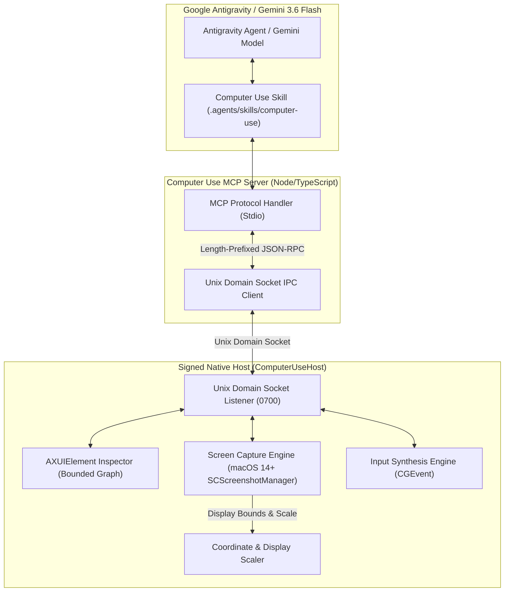

# Antigravity Computer Use (`agy-computer-use`)

[](https://apple.com)
[](https://deepmind.google/technologies/gemini/)
[](https://antigravity.google)
[](#)

> Architecture specification and deterministic v0.1 vertical slice for Google Antigravity & Gemini 3.6 Flash on macOS.

---

## Technical Overview

`agy-computer-use` defines an enterprise-grade Computer Use platform for macOS. It combines native macOS Accessibility (`AXUIElement`) graph inspection with screen perception and input automation via a signed native host application and an MCP server bridge.

In this **v0.1 foundation release**, the system provides a production-grade architecture, IPC protocol framing, typed error contracts, coordinate transformation logic, bounded AX tree traversal algorithms, strict MCP tool definitions, and deterministic unit/integration test suites backed by a test host backend. Real OS driver invocation (`ScreenCaptureKit`, `CGEvent`, `AXUIElement`) is gated behind macOS TCC permissions and a signed app bundle.

### Core Architecture



---

## Key Capabilities & Architectural Guarantees

1. **Dual Perception Pipeline**:
   - **Visual Snapshot**: High-resolution image capture with aspect-ratio preservation, metadata (scale, bounds, rotation), and normalized `0...999` integer coordinates.
   - **Accessibility Tree (AX)**: Bounded element graph extraction (max depth 10, max nodes 500) with automatic redaction of password and secure text fields.

2. **Precision Control Suite & Preconditions**:
   - **Supported Actions**: Click, double-click, move, drag, type, keyboard shortcuts, scroll.
   - **Mutation Safety**: Actions require prior capture/topology freshness validation (`capture_id`, `topology_version`, non-whitespace `intent` max 200 chars), serialize input events, and enforce held-input release.

3. **Multi-Monitor & Coordinate Authority**:
   - The native Swift host is the single source of truth for display topology and coordinate transformation across primary/secondary displays with negative origins.
   - Normalizes coordinates between logical points, physical retina pixels, and the agent's `0...999` grid.

4. **IPC & Process Security**:
   - IPC occurs over a Unix domain socket residing in an owner-only directory (`chmod 0700`).
   - Standard output (`stdout`) of the MCP server is strictly reserved for MCP JSON-RPC protocol messages. Logging is routed exclusively to `stderr`.

---

## Repository Structure

```text
agy-computer-use/
├── AGENTS.md                  # Development guidelines, safety policies & contracts
├── README.md                  # Front-door specification and setup guide
├── LICENSE                    # Apache 2.0 License
├── SECURITY.md                # Vulnerability reporting & IPC security boundaries
├── CONTRIBUTING.md            # Developer setup and contribution guide
├── .mise.toml                 # Toolchain pins (Node 22.23.1, pnpm 10.33.0)
├── apps/
│   └── computer-use-host/     # Native Swift Host Package (macOS 14+)
├── mcp/
│   └── computer-use-mcp/      # Model Context Protocol server (TypeScript)
├── .agents/skills/
│   └── computer-use/          # Antigravity skill package definition
├── docs/                      # Technical specs, ADRs, schemas, and fixtures
├── plans/                     # Implementation plan and status ledger
└── proof/                     # Verification test outputs and proof packet
```

---

## Tool API Specifications

The MCP server exposes the following tools to Gemini 3.6 Flash / Antigravity:

| Tool Name | Required Parameters | Description |
|---|---|---|
| `computer_use_status` | None | Returns host connectivity, active display topology, and TCC permission state. |
| `computer_use_observe` | `display_id?` | Captures current desktop display screenshot and metadata. |
| `computer_use_ax_tree` | `max_depth?`, `app_id?` | Returns bounded macOS Accessibility element graph with redacted sensitive inputs. |
| `computer_use_click` | `x`, `y`, `capture_id`, `topology_version`, `intent` | Moves cursor and performs click at specified 0...999 coordinates. |
| `computer_use_move` | `x`, `y`, `capture_id`, `topology_version`, `intent` | Moves mouse cursor to 0...999 coordinates. |
| `computer_use_drag` | `start_x`, `start_y`, `end_x`, `end_y`, `capture_id`, `topology_version`, `intent` | Performs drag and drop action. |
| `computer_use_type` | `text`, `capture_id`, `topology_version`, `intent` | Types text string into active focused element (`press_enter?` option supported). |
| `computer_use_shortcut` | `keys`, `capture_id`, `topology_version`, `intent` | Triggers keyboard shortcut combination. |
| `computer_use_scroll` | `x`, `y`, `capture_id`, `topology_version`, `intent` | Scrolls container at target 0...999 location (`direction?` helper option supported). |

---

## Requirements & Setup

- **OS**: macOS 14.0 (Sonoma) or newer.
- **Runtimes**:
  - Node.js `v22.23.1` (managed via `mise`).
  - pnpm `10.33.0`.
  - Swift 5.9+ / Xcode Command Line Tools.

### Running Tests

- **Swift Unit Tests**:
  ```bash
  cd apps/computer-use-host && swift test
  ```
- **TypeScript MCP Tests**:
  ```bash
  cd mcp/computer-use-mcp && pnpm check && pnpm test
  ```
