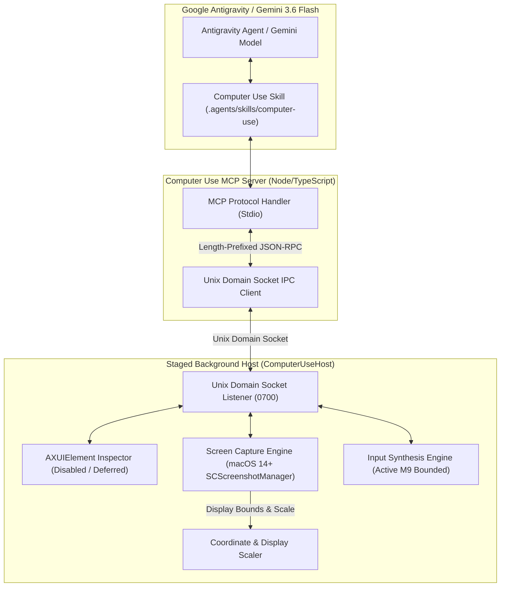

# Antigravity Computer Use (`agy-computer-use`)

[](https://apple.com)
[](https://deepmind.google/technologies/gemini/)
[](https://antigravity.google)
[](#)

> Architecture specification and production-bounded M9 computer use surface for Google Antigravity & Gemini 3.6 Flash on macOS.

---

## Technical Overview

`agy-computer-use` defines an enterprise-grade Computer Use platform for macOS. It combines native macOS screen perception, display topology management, bounded input synthesis, and Unix domain socket IPC via a native host application and an MCP server bridge.

Building on the completed **Milestone D2 observation & source-hardening foundation**, Milestone M9 implements and physically dogfoods the five-tool MCP surface (`computer_use_status`, `computer_use_observe`, `computer_use_click`, `computer_use_type`, `computer_use_shortcut`) for macOS desktop interactions.

Local ad-hoc staged-app/TCC operation is proven via `ComputerUseHost.app`. Stable team code signing, distribution, and notarization remain un-gated / future work. AX-tree inspection (`ax_tree`) and unbounded input actions (`move`, `drag`, `scroll`) remain disabled and deferred.

### Core Architecture



---

## Tool API Specifications (Milestone M9 Active Bounded Surface)

The MCP server exposes the following active tools to Gemini 3.6 Flash / Antigravity:

| Tool Name | Required Parameters | Description |
|---|---|---|
| `computer_use_status` | None | Returns host connectivity, active display topology, TCC permission state, and mutation lockout state. |
| `computer_use_observe` | `display_id?` | Captures primary or target display screenshot, returning `capture_id`, `topology_version` (`top-sha256-...`), and JPEG image payload. |
| `computer_use_click` | `x`, `y`, `intent`, `capture_id`, `topology_version`, `button?`, `click_count?` | Dispatches single mouse click at normalized (0..999) coordinates on active display topology. |
| `computer_use_type` | `text`, `intent`, `capture_id`, `topology_version`, `press_enter?` | Synthesizes Unicode text entry into focused window/element. |
| `computer_use_shortcut` | `keys`, `intent`, `capture_id`, `topology_version` | Dispatches bounded keyboard shortcut sequence (e.g. `['cmd', 'tab']`). |

*Note: Unbounded continuous actions (`move`, `drag`, `scroll`) and `ax_tree` remain disabled/deferred and fail closed with `MUTATION_DISABLED` or `TARGET_UNREACHABLE`.*

---

## Requirements & Setup

- **OS**: macOS 14.0 (Sonoma) or newer.
- **Runtimes**:
  - Node.js `v22.23.1` (managed via `mise`).
  - pnpm `10.33.0`.
  - Swift 5.9+ / Xcode Command Line Tools.

### Running Tests & Readiness Checks

- **Production Host Lifecycle Commands**:
  - Start Native Host:
    ```bash
    ./bin/agy-computer-use host-start
    ```
  - Check Host Status (read-only):
    ```bash
    ./bin/agy-computer-use host-status
    ```
  - Stop Native Host:
    ```bash
    ./bin/agy-computer-use host-stop
    ```

- **Process Authority & Lifecycle Policies**:
  - **Terminal Owner Correlation**: Host lifecycle commands (`host-start`, `host-status`, `host-stop`) communicate with the supervisor owner process over `control.sock`. `host-stop` RPC awaits exact native child close and socket residue verification before returning terminal receipt (containing generation ID, daemon PID, native PID, and `native_closed: true`).
  - **Non-Override Runtime Directory Policy**: Public CLI host commands operate strictly on the canonical runtime directory (`/tmp/agy-computer-use-<uid>`), enforcing single-owner Unix domain socket permissions (`0700`) and inode identity validation to prevent socket hijacking or symlink attacks. Custom runtime directory overrides (`COMPUTER_USE_RUNTIME_DIR`) are restricted to isolated test harnesses and rejected or fail-closed in public production CLI operations.

> [!NOTE]
> Milestone D2 established the completed native observation and source-hardening foundation. Milestone M9 implements and physically dogfoods bounded input synthesis (`click`, `type`, `shortcut`) driven live via Google Antigravity. Local ad-hoc staged-app/TCC operation is proven; team signing/notarization remains future work. A denied Screen Recording or Accessibility state remains a human TCC gate.

- **Authoritative Native Swift Test Authority**:
  ```bash
  ./bin/agy-computer-use test-native
  ```
- **Focused Production Host Lifecycle Test Authority**:
  ```bash
  node --test bin/host-lifecycle.test.mjs
  ```
- **TypeScript MCP Server Tests & TypeScript Check**:
  ```bash
  cd mcp/computer-use-mcp && pnpm check && pnpm test
  ```
- **Stage Background App & Verify Principal Classification**:
  ```bash
  ./bin/agy-computer-use stage-host-app
  ./bin/agy-computer-use host-principal
  node --test bin/host-app.test.mjs
  ```
- **Offline Production MCP Readiness Check**:
  ```bash
  ./bin/agy-computer-use production-ready
  ```
