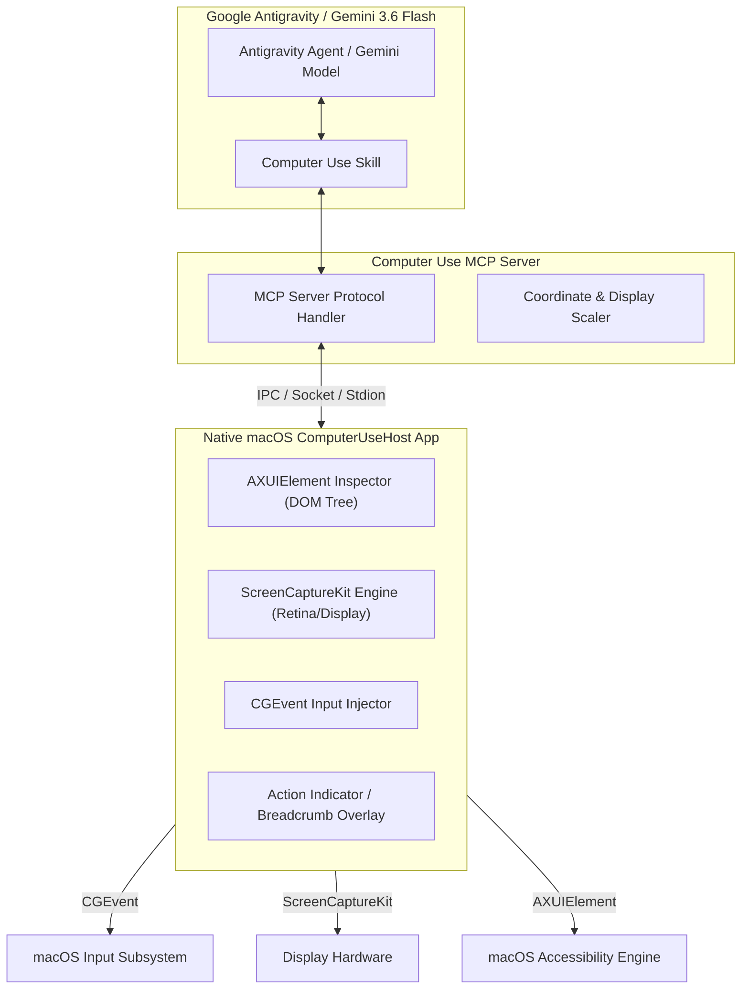

# Antigravity Computer Use (`agy-computer-use`)

[](https://apple.com)
[](https://deepmind.google/technologies/gemini/)
[](https://antigravity.google)

> High-performance, dual-mode (Accessibility + Multimodal Vision) Computer Use agent platform for Google Antigravity & Gemini 3.6 Flash.

---

## Technical Overview

`agy-computer-use` delivers next-generation computer use capabilities for macOS. Going beyond standard pixel-only screenshot vision, it combines **native macOS Accessibility (AXUIElement) object graph inspection** with **real-time hardware-accelerated Screen Capture (ScreenCaptureKit)** and **CGEvent synthesis**.

### Core Architecture



---

## Key Capabilities (Codex-Parity & Beyond)

1. **Dual Perception Pipeline**:
   - **Visual Snapshot**: High-resolution image capture (compressed, retina-calibrated, normalized to 1000x1000 or native resolution).
   - **Accessibility Tree (AX)**: Precise UI element hierarchy extraction (roles, labels, titles, bounding boxes, enable states) allowing instant click target resolution without visual ambiguity.

2. **Precision Control Suite**:
   - **Click Operations**: Single, double, triple, right, middle, mouse-down, mouse-up.
   - **Drag & Drop**: Smooth trajectory calculation between source and destination coordinates.
   - **Keyboard & Shortcuts**: Text typing, modifier keys (`Cmd`, `Opt`, `Ctrl`, `Shift`), global keyboard shortcuts (`Cmd+C`, `Cmd+V`, `Cmd+Space`).
   - **Scrolling**: Horizontal and vertical natural trackpad/wheel emulation.

3. **Multi-Monitor & Retina Aware**:
   - Automatic scaling conversion between logical points (macOS coordinate system) and physical pixels.
   - Display selection and bounding box clipping.

4. **Visual Action Feedback Overlay**:
   - On-screen visual pulse and trajectory indicators during agent execution for transparent human oversight.

---

## Repository Structure

```text
agy-computer-use/
├── AGENTS.md                  # Development guidelines, safety policies & contracts
├── README.md                  # Front-door specification and setup guide
├── apps/
│   └── computer-use-host/     # Native Swift Desktop Host App / Daemon
├── mcp/
│   └── computer-use-mcp/      # Model Context Protocol server bridge
├── skills/
│   └── computer-use/          # Antigravity skill package definition
├── docs/                      # Comprehensive technical documentation & API specs
├── plans/                     # Implementation milestones and status tracking
└── proof/                     # Empirical validation test runs and benchmarks
```

---

## Tool API Specifications

The MCP server exposes the following low-latency tools to Gemini 3.6 Flash / Antigravity:

| Tool Name | Parameters | Description |
|---|---|---|
| `computer_use_screenshot` | `display_id?` | Captures current desktop display image and returns visual artifact. |
| `computer_use_ax_tree` | `app_name?`, `depth?` | Returns macOS Accessibility element tree with exact pixel coordinates. |
| `computer_use_click` | `x`, `y`, `button?`, `click_count?` | Moves cursor and performs click at specified coordinates. |
| `computer_use_move` | `x`, `y` | Moves mouse cursor to coordinates. |
| `computer_use_drag` | `start_x`, `start_y`, `end_x`, `end_y` | Performs drag and drop action. |
| `computer_use_type` | `text`, `delay_ms?` | Types text string into active window element. |
| `computer_use_shortcut` | `keys` (e.g. `["command", "c"]`) | Triggers keyboard shortcut combination. |
| `computer_use_scroll` | `x`, `y`, `delta_x`, `delta_y` | Scrolls scrollable container at target location. |

---

## Requirements & Prerequisites

- **OS**: macOS 14.0 (Sonoma) or newer.
- **Runtimes**:
  - `Mise` for runtime management.
  - Swift 5.9+ / Xcode Command Line Tools.
  - Node.js 20+ / Bun 1.1+.
- **Permissions Required**:
  - System Settings -> Privacy & Security -> **Accessibility** (for CGEvent injection & AXUIElement).
  - System Settings -> Privacy & Security -> **Screen Recording** (for ScreenCaptureKit).

---

## Roadmap

- [ ] **Phase 1**: Architecture & Directory Setup (Scaffolding).
- [ ] **Phase 2**: Native Swift Host (`ComputerUseHost`) for AXUIElement & CGEvent.
- [ ] **Phase 3**: MCP Server Implementation (`computer-use-mcp`).
- [ ] **Phase 4**: Antigravity Skill Definition (`skills/computer-use`).
- [ ] **Phase 5**: Full Integration Testing, Benchmarks, & Proof.
