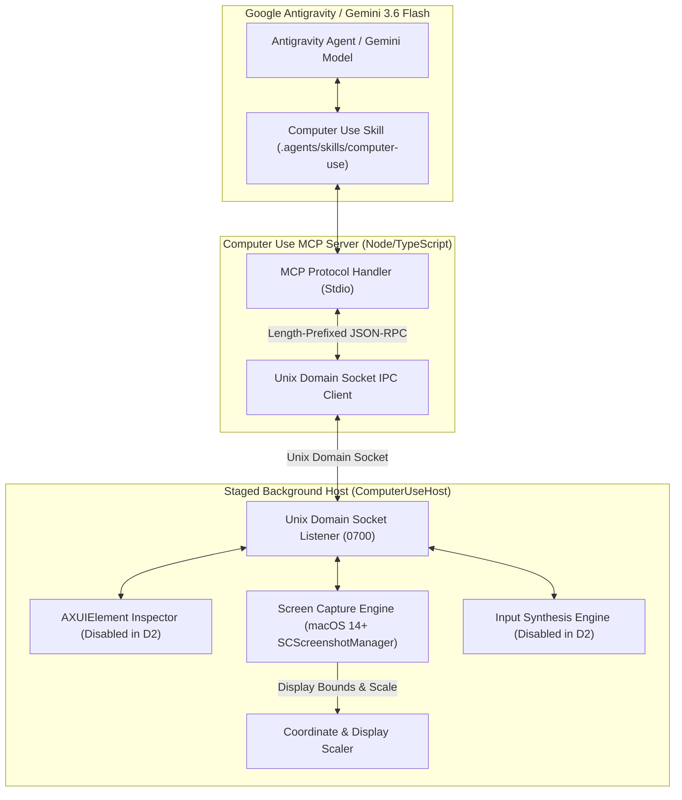

# Antigravity Computer Use (`agy-computer-use`)

[](https://apple.com)
[](https://deepmind.google/technologies/gemini/)
[](https://antigravity.google)
[](#)

> Architecture specification and production-bounded D2 observation slice for Google Antigravity & Gemini 3.6 Flash on macOS.

---

## Technical Overview

`agy-computer-use` defines an enterprise-grade Computer Use platform for macOS. It combines native macOS screen perception, display topology management, and Unix domain socket IPC via a native host application and an MCP server bridge.

In this **Milestone D2 observation slice**, the system provides nonprompting screen recording preflight access (`CGPreflightScreenCaptureAccess`), native ScreenCaptureKit display capture (`SCScreenshotCaptureEngine`), IEEE-754 bitPattern topology SHA-256 tokens (`top-sha256-...`), actor-isolated JPEG encoding, monotonic generation fences, per-frame UDS deadlines, and strict Zod DTO schema validation. Input synthesis and accessibility tree inspection are disabled in D2 and reserved for subsequent milestones.

### Core Architecture



---

## Tool API Specifications (Milestone D2 Observation-Only Slice)

The MCP server exposes the following active tools to Gemini 3.6 Flash / Antigravity in D2:

| Tool Name | Required Parameters | Description |
|---|---|---|
| `computer_use_status` | None | Returns host connectivity, active display topology, TCC permission state, and mutation lockout state. |
| `computer_use_observe` | `display_id?` | Captures primary or target display screenshot, returning `capture_id`, `topology_version` (`top-sha256-...`), and JPEG image payload. |

*Note: Action tools (`click`, `move`, `drag`, `type`, `shortcut`, `scroll`) and `ax_tree` are disabled in D2 and fail closed with `MUTATION_DISABLED` or `TARGET_UNREACHABLE`.*

---

## Requirements & Setup

- **OS**: macOS 14.0 (Sonoma) or newer.
- **Runtimes**:
  - Node.js `v22.23.1` (managed via `mise`).
  - pnpm `10.33.0`.
  - Swift 5.9+ / Xcode Command Line Tools.

### Running Tests & Readiness Checks

- **Production Host Lifecycle Commands**:
  - Start Native Host:
    ```bash
    ./bin/agy-computer-use host-start
    ```
  - Check Host Status (read-only):
    ```bash
    ./bin/agy-computer-use host-status
    ```
  - Stop Native Host:
    ```bash
    ./bin/agy-computer-use host-stop
    ```

> [!NOTE]
> This milestone is **observation-only**. Input mutation remains disabled, the principal remains `ad_hoc_ephemeral`, and a denied Screen Recording state is a human TCC gate rather than permission to change TCC. Live screenshot proof is not claimed in this milestone.

- **Authoritative Native Swift Test Authority**:
  ```bash
  ./bin/agy-computer-use test-native
  ```
- **Focused Production Host Lifecycle Test Authority**:
  ```bash
  node --test bin/host-lifecycle.test.mjs
  ```
- **TypeScript MCP Server Tests & TypeScript Check**:
  ```bash
  cd mcp/computer-use-mcp && pnpm check && pnpm test
  ```
- **Stage Background App & Verify Principal Classification**:
  ```bash
  ./bin/agy-computer-use stage-host-app
  ./bin/agy-computer-use host-principal
  node --test bin/host-app.test.mjs
  ```
- **Offline Production MCP Readiness Check**:
  ```bash
  ./bin/agy-computer-use production-ready
  ```
