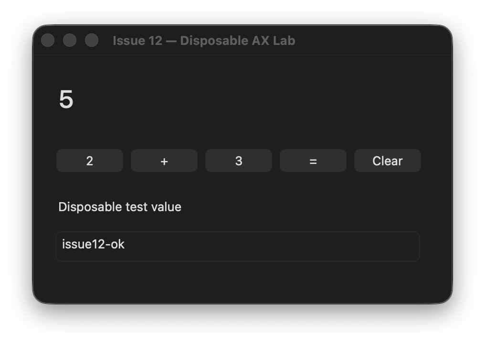

# Issue 12: qualified background AX coexistence

Source: `eb7968b90d3065b2961756f086c88c1457a6d5f7` (parent `5ab20120005980baea8fb97855ebef1bb8b5925c`).
Branch: `codex/issue-12-action-observation`. Worktree:
`/Users/bobbybones/Developer/worktrees/agy-computer-use-issue-12-action-observation`.
Native frozen executable SHA-256: `ec29ff317fe02fa739944a923f381586e893c5e1eb4e8cb9e603c97c98fe8e06`.
[Manifest](issue_12_background_20260916/build-manifest.json) hashes every production
native/MCP source file and the frozen executable. The test ran that immutable
copy, not a build path that verification could relink. This is direct development
host proof, not staged-app/TCC-principal qualification.

## Contract and current reference

[Explicit operator requirement](https://github.com/saariuslystoned/agy-computer-use/issues/12#issuecomment-5697178878):
allow unrelated activity while background semantic AX actions run; retain real
takeover cancellation. `AGENTS.md` now requires refreshing the current upstream
@Computer runtime and the repository skill before parity claims. The current
exposed `cua` API was accessed on September 16, 2026 and used on the same disposable
calculator/form design. Its source SHA/release version was not exposed; this is
not a claimed checkout of upstream main or knowledge of private implementation.
The upstream tool completed calculator/text entry. Current upstream `typeText`
provided the separately targeted Sentinel keyboard stimulus below. Controllers
were separated by app for qualification; earlier mixed-controller trials and
stale foreground samples are not authority for the final result.

## Executed checks

| Boundary | Executed assertion / result |
| --- | --- |
| Native authority | 44/44 cases passed, including target events, activation then away, healthy movement, disabled tap, trust loss, secure input, termination, invalid-versus-invalid epochs, and exactly-once uncertain setter. Existing identity/ancestry/replay checks retained. |
| MCP and protocol | 66/66 tests passed, including app/global scope, invalid scope rejection and explicitly mapped JSON fixtures. TypeScript check passed. |
| Build/readiness | Strict concurrency / warnings-as-errors native build and configured production readiness passed. |
| AGY live calculator | Gemini 3.8 Flash High, high effort, real MCP + real native host: Clear, 2, +, 3, =; five compound actions, one initial AX inspection, no intervening AX calls; final result 5. Exit 0, 41.74 s whole CLI run. |
| Unrelated physical pointer input | During the pending/action sequence: 240 samples, 48 pointer positions, combined-session mouse-move counter increased by 388; target never foreground. All five actions succeeded under app scope. The prior global counter rule would invalidate these leases. |
| Unrelated keyboard input | After target inspection, the upstream tool typed into the separate Sentinel process; pending native AX setter then succeeded and fixture state became `background-qualified`. No global-HID posts. This is targeted synthetic keyboard input, not claimed physical keyboard qualification. |
| Target keyboard takeover | One non-text key delivered to the disposable target PID after inspection produced USER_INTERVENED, reason target event type 11; planned `key-must-not-write` value did not appear. |
| Activation then away | Target became foreground, then previous app was restored. The original lease still returned USER_INTERVENED with activation-notification reason; planned `takeover-must-not-write` value did not appear. |

The [AGY result](issue_12_background_20260916/agy-result.json),
[protocol metadata](issue_12_background_20260916/mcp-events.jsonl),
[coexistence summary](issue_12_background_20260916/coexistence-summary.json),
[Sentinel proof](issue_12_background_20260916/sentinel-proof.json),
[key proof](issue_12_background_20260916/target-key-proof.json), and
[takeover proof](issue_12_background_20260916/takeover-proof.json) contain asserted
results. Raw AGY transcripts/prompts and operator activity traces are not published.
Fixture helpers are in `proof/fixtures/issue12_*.swift`. The stimulus key injector
is proof-only and is never part of production action dispatch.

## Limits and open acceptance

- This is conservative application scope: any target-window input/activation
  invalidates the current lease. Exact-window discovery/images and independent
  per-session/per-window lease storage remain Issue #12 work.
- Foreground/unqualified targets retain global guarding; an app-scoped monitor
  losing coverage fails closed. No new system permission was requested.
- The calculator qualification proves coexistence with real mouse activity and
  no target foreground takeover. Focused-element sampling returned AX error
  -25204, so no fresh focused-element-isolation claim is made. Source and receipts
  show no production global-HID posts. Wider native-app qualification remains open.
- Earlier AGY trials completed the separate-action calculator/form baseline and
  dispatched a compound form write, but the immediate form observation sometimes
  contained only the application root. A later AGY read recovered the controls,
  then model delay expired its 30-second lease. Full compound form/unchanged/timeout
  live qualification is not passed; this is why PR #13 remains draft. Native/MCP
  tests cover unchanged and timeout semantics; they do not replace live proof.
- The live trial exposed an inherited 100 ms observation timeout on returned AX
  references: the next AppKit press executed but returned unknown. Production now
  restores the independent 5 s mutation budget. The final chained calculator
  presses passed at approximately 140–151 ms each without repeating a mutation.
- No general latency/speedup claim: the recorded five-action calculator sequence
  uses five action-plus-state exchanges instead of ten separate action/read
  exchanges, excluding initial inspection, but trials were not controlled latency
  benchmarks and the full form comparison remains incomplete.
- The installed canonical host was not replaced. Only disposable test processes
  and a temporary AGY MCP registration were used.
