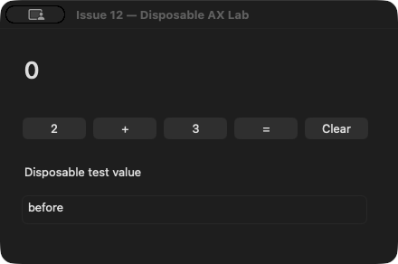
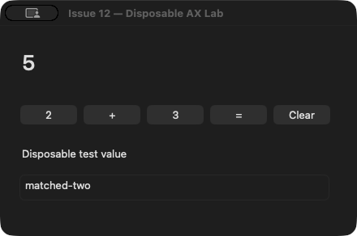
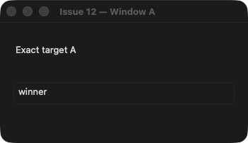
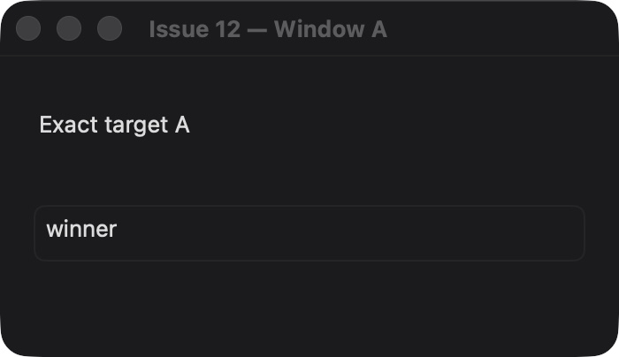
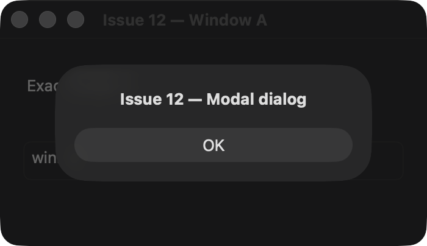

# Issue 12 — exact-window observations, sessions, and live qualification

Repository: `saariuslystoned/agy-computer-use`. Branch: `codex/issue-12-completion`.
Worktree: `/Users/bobbybones/.codex/worktrees/4b04/agy-computer-use`.
Base: `95165752e0d4f0f16c7d4ef5df8fefdd5654817f` (PR #13's partial implementation).
Review: [PR #14](https://github.com/saariuslystoned/agy-computer-use/pull/14).

This checkpoint completes the bounded Issue #12 implementation and disposable-fixture qualification described below. It does not establish universal application compatibility, install a canonical host, implement the HUD, or close Issue #7's separate native exclusive-global-input authorization gap. The issue remains open for review/merge.

## Frozen source and executable identity

Proof uses separately frozen executables, never a silently rebuilt running binary:

| Source | Executable SHA-256 | Qualification |
| --- | --- | --- |
| `53fd863318461735c3b6740ef8b41d738027e19b` | `be37c986e7b2694d02d3ba21c377aafb72c9055f16583cd4245a5fa80cda887b` | Matched AGY calculator/form; physical keyboard and mouse isolation |
| `6e6484b65ee2064040b964fc8b8f1c57374771c5` | `5b239697f7f98033dad1762e6c225e18f9b35ddbb49177d2682d3cb728904be1` | Closed-window replacement fix; human target takeover; live unchanged, timeout, expiry/recovery and observation failure |
| `37c99db378d9e83dccc32b4768c1030162b74764` | `dda3717baf70b77a0d0a7e9ddd42621a35b5c47f85a4cbc1a9dae4bc380735d9` | Attached-sheet guard development checkpoint |
| `979f973f7a54cd14810bf2808493ded234615037` | `607f0e658139f287931fdfc202b19ac6736324cb23cb2159c2ce1ccdf287fd70` | Final 26-case window/session suite; AGY exact-window and controlled observation-failure completion |

[Final build manifest and per-file hashes](issue_12_completion_20260916/accepted-build-manifest.json) identify the production files. [Executed source-equivalence assertions](issue_12_completion_20260916/source-equivalence.json) verify that the semantic action, compound-observation and input-monitor implementations used for physical/matched proof are unchanged. Later changes are restricted to exact-window binding, the incomplete-discovery selection condition, and a behavior-preserving capture-engine initializer repair for Swift 5.10. Physical results are attributed to their actual executable, not relabeled as runs of the final binary.

## Implementation contracts

- Recover success-empty app hierarchies through the selected app's public AX windows/main/focused-window attributes, mark fallback trees incomplete, and reject unusable root-only compound candidates within the original deadline. Dispatch happens once; polling only reads.
- Discover explicit app/window targets. Bind opaque window references to session, process birth, exact AX object, public on-screen window-server ID and window set. Ambiguity, replacement and new top-level dialogs require explicit rediscovery. Off-display auxiliary windows are omitted with an incomplete-inventory flag; visible siblings remain explicitly selectable and implicit selection is rejected.
- Return the selected window image, bounded AX semantics/capabilities, actual display, geometry transforms and timing together. Capture is bracketed by AX reads, with continuous takeover monitoring. Observed drift fails without image or authority. Metadata states `atomic: false`, `consistency: stable_bracket`, AX secure-value redaction and **no image redaction**.
- Reject attached modal sheets for parent-window image/authority because the parent image cannot be assumed to include their separate surface. Fresh explicit-app AX inspection remains available for resolving the dialog. Minimized/off-screen and ambiguous targets fail closed.
- Keep up to 32 session/target leases for 30 seconds and 64 window references for five minutes. Independent targets survive inspection. A first writer consumes all overlapping target authority before dispatch; app-wide compatibility leases overlap all that app's windows. Session close and bounded cleanup release retained state. Target intervention remains app-scoped, not window-scoped.
- Preserve one-shot/replay, process birth, semantic/ancestry/window drift, expiry, uncertain outcomes, and no automatic mutation retry or global-HID fallback. MCP assigns a private logical session per connection; the owner-only socket remains the authentication boundary.

## Matched AGY calculator and form

Both runs used ordinary AGY CLI, `gemini-3.8-flash-high`, high effort, the same frozen host, the same disposable app and initial state: calculator `0`, form `before`. Each pressed Clear, 2, +, 3, =, verified `5`, then set and verified `matched-one` and `matched-two`. Both completed all seven mutations with zero stale errors, intervention errors or operator corrections.

| Measurement | Separate action/read | Compound action/observation |
| --- | ---: | ---: |
| Elapsed seconds | 115.16 | 99.60 |
| MCP exchanges, including status and initial tree | 16 | 9 |
| Action calls | 7 | 7 |
| Observation-bearing response bytes | 70,058 | 84,625 |
| Total response bytes | 76,423 | 86,404 |

[Machine-checked comparison](issue_12_completion_20260916/matched-summary.json) and metadata-only relay records accompany the [baseline result](issue_12_completion_20260916/final-baseline-agy.json) and [compound result](issue_12_completion_20260916/final-compound-agy.json). Counts describe MCP/model tool exchanges, not unexposed internal model turns. One matched pair supports fewer exchanges; it does not establish a general latency improvement. Compound responses were larger.

## Human input and takeover

The Sentinel was a separate process. Its content was never captured or preserved; only aggregate counters/focus comparisons were retained.

- [Physical keyboard](issue_12_completion_20260916/final-keyboard-isolation.json): 70.00 seconds, 439 hardware key-down events, 1,262/1,262 samples with Sentinel in front, zero target-front samples, focus-read errors, focused-element changes or pointer-position changes. AGY's background calculator/form sequence completed.
- [Physical mouse](issue_12_completion_20260916/final-mouse-isolation.json): 30.05 seconds, 3,564 hardware mouse-move events and 525 pointer-position changes, 545/545 Sentinel-front samples, zero target-front samples/focus errors/focus changes. [All 25 background form updates](issue_12_completion_20260916/final-mouse-actions.json) were observed and posted zero global HID events.
- [Human target takeover](issue_12_completion_20260916/final-takeover.json): the user clicked Window A. A live lease 5.641 seconds old failed with `USER_INTERVENED`; the forbidden write was absent. An independent app's pending write still succeeded with zero global HID posts. The controller refreshed read-only leases while waiting and reacted immediately to activation, avoiding a false expiry result. An attempted upstream Raise setup action was refused before dispatch; the user found and clicked the window themselves.

Sticky activation-followed-by-switch-away and monitor-coverage failure remain exercised by the existing native intervention tests and PR #13's live proof; the intervention implementation is unchanged. The new human takeover result above was checked immediately on activation and is not mislabeled as a second switch-away trial.

## Exact windows, displays and sessions

The operator connected two external displays. [Topology](issue_12_completion_20260916/windows/topology.json): built-in display 1 (2x), portrait display 2 at `(-1440,-1443)` (1x, 270°), and display 4 at `(0,-1080)` (2x). The disposable 350×202-point Window A produced 700×404, 350×202 and 700×404 images respectively. Host-selected display IDs, global bounds, pixel scales, normalized offsets, AX/window binding, image hashes and bracket timing were asserted.

[The 26 executed assertions](issue_12_completion_20260916/windows/assertions.json) cover ambiguous selection, foreign sessions, wrong apps, independent apps and windows, same-window first-writer conflict, old authority after all three movements, session-close isolation, same-position replacement, new top-level dialog rediscovery, attached-modal-sheet image/authority rejection, explicit-app dialog AX availability, real 31-second expiry, off-display sibling availability with implicit-selection refusal, and absence of rejected writes. One read-only bracket re-observation was needed after dialog transitions; no mutation was retried.

The controller in [the reproducible fixture driver](fixtures/issue12_live_windows.py) moves only its own disposable windows through their own stimulus file. It does not synthesize system mouse motion. Earlier incomplete attempts are not counted as successful full runs: a user movement caused a bracket rejection; retained off-screen closed windows exposed the discovery defect; an attached sheet exposed the image/AX risk. Both production defects were fixed and the complete suite rerun.

## Negative outcomes and recovery

AGY's metadata-only [first edge trial](issue_12_completion_20260916/edge-first-attempt-metrics.jsonl) executed unchanged snapshot, bounded semantic-change timeout, deliberate 31-second lease expiry, fresh inspection, and a distinct new verified write. The expired value was never replayed. No timed-out observation returned state.

The first failure fixture had been launched without a usable Launch Services birth identity; the host refused it. That trial did not complete and its timeout is preserved in [the result](issue_12_completion_20260916/edge-first-attempt-agy.json). Relaunching through Launch Services restored valid process identity. A single AGY setter then dispatched, the fixture exited, and observation failed with `USER_INTERVENED` as monitoring coverage disappeared, returning no state. The initial harness had over-specified `TARGET_UNREACHABLE`; that is a harness expectation error, not evidence that dispatch or the observation succeeded. The [terminal bounded AGY trial](issue_12_completion_20260916/accepted-terminal-agy.json) completed both exact-window MCP observation and the corrected controlled-failure contract in 113.86 seconds on final source `979f973f7a54cd14810bf2808493ded234615037`. Its single mutation dispatched once, observation failed with `USER_INTERVENED` after three read attempts in 305.94 ms, and no state was returned. AGY verified both outcomes and ended without another tool call. [Executed edge assertions](issue_12_completion_20260916/edge-assertions.json) and [metadata](issue_12_completion_20260916/accepted-terminal-metrics.jsonl) bind those claims.

An intermediate exact-window trial found an off-display auxiliary window blocking the visible form's discovery. The [failure is preserved](issue_12_completion_20260916/off-display-agy-attempt.json). The fix exposes usable siblings with `truncated: true` and rejects implicit selection; the final AGY trial and live suite both passed. The off-display fixture explicitly bypasses AppKit's normal frame constraint to create the negative geometry stimulus; production window selection and guards remain unchanged.

## Verification, review and limits

Local authority: 45 native cases, 70 MCP tests, TypeScript, strict-concurrency/warnings-as-errors Swift build, and twelve-tool configured/minimal-PATH production readiness. [Result markers and raw-log digests](issue_12_completion_20260916/local-checks.json) preserve local evidence; raw generated logs remain in the dated run directory. New native tests exercise the production root recovery, lease store, geometry, window route and failure invalidation; MCP tests exercise private sessions, close, binding, timing, transforms and corrupted-image rejection.

Accepted review findings: root-only compound observations; natural success-empty AXChildren/AXWindows; lost takeover monitoring across an image bracket; closed off-screen window aliases; attached-sheet parent image ambiguity; off-display auxiliary windows blocking visible siblings. All changed the named production authority and have discriminating proof. Rejected claims: an earlier controlled form-only fix was sufficient; a title alone identifies a replacement; bracketed capture is atomic; physical typing can be inferred from synthetic typing; fewer exchanges means fewer bytes or universal speedup.

Source CI initially rejected a test-manifest separator typo, then the Swift 5.10 actor-initializer autoclosure. Both were repaired by additive commits; neither failed run is represented as passing. Final source `979f973f7a54cd14810bf2808493ded234615037` passed both [push CI](https://github.com/saariuslystoned/agy-computer-use/actions/runs/35104580052) and [PR CI](https://github.com/saariuslystoned/agy-computer-use/actions/runs/35104583736). [Checkpoint metadata](issue_12_completion_20260916/checkpoint.json) binds source CI; the exact proof-child identity and its push/PR CI are recorded externally in the PR-visible closeout to avoid a self-referential proof chain.

The public OpenAI `cua` interface and repository skill were refreshed September 16, 2026 (including explicit app/tab bindings, AX differences, combined AX/image and action-plus-state). No upstream release/source SHA was exposed, so no audited upstream-main or private-implementation parity is claimed. Apple's public ScreenCaptureKit window filter and SDK AX window/child/sheet roles informed the implementation.

[Cleanup receipt](issue_12_completion_20260916/cleanup.json): six verified task-owned hosts/fixture processes were stopped, both task sockets disappeared, and the temporary `issue12-completion` MCP registration was removed. The canonical host PID 58198/socket and unrelated AGY processes remained intact. Proof artifacts were preserved. No TCC changes, global input fallback, canonical replacement or merge occurred. Issue dispositions are recorded in GitHub after this proof checkpoint.
